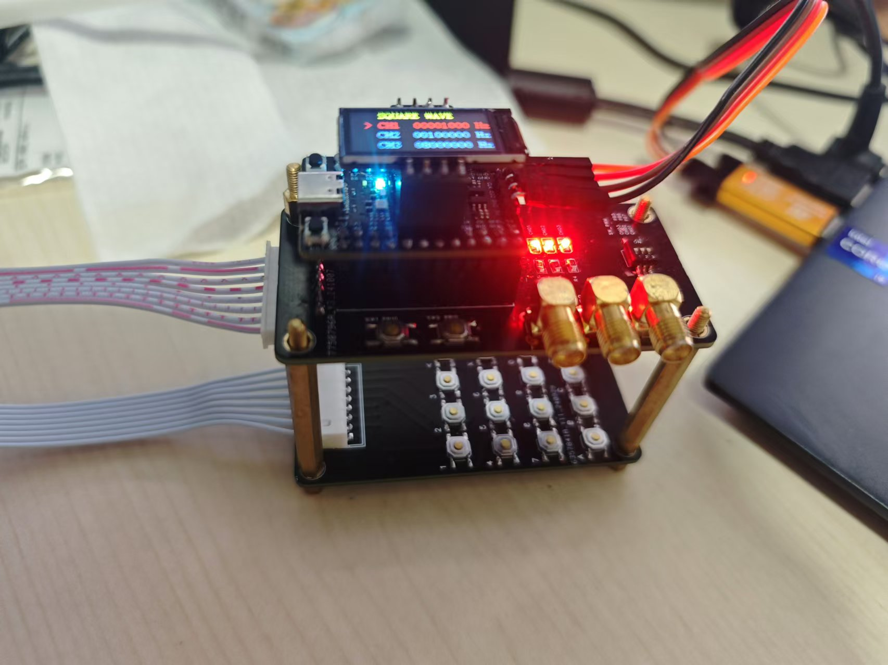

# YSU-EDC-SeasonFall-ProblemA
喜欢做电赛积分赛的小朋友们你们好啊，我不是组委会成员，今天我就要把A题风风光光，把PWM波做成黄桃罐头

## 项目说明
MCU STM32G431CBU6，核心板淘宝买的，这里就不放购买链接了，可以线下找我要

项目的核心主要就是怎样读入你要输出的频率，这里我用了自己开的矩阵键盘，自己搓了个驱动

板子需要自己打，晚些时候我放在立创开源平台，再发链接，大家可以去复刻

其实我个人是一个软件，硬件特别特别菜，所以我是能用软件解决的问题全用软件去解决

硬件凑合用吧，又不是不能出波

## 主要功能
输出方波 矩阵键盘读入 屏幕输出 LED展示状态 拨码开关控制是否输出  

### 没有别的功能了，也没有创新点，我真的很菜，GitHub都不太会用
大家可以凑合着复刻，复刻一定要给我GitHub点星星！